<div align="center">



**在 Obsidian 里刷生财有术 —— 只看你感兴趣的，好帖一键成笔记**

[](https://obsidian.md)
[](https://scys.com)
[](LICENSE)
[](https://github.com/zackzhangkai/scys-radar-obsidian/releases)

</div>

---

## 这是什么

[生财有术](https://scys.com) 是一个优质但信息量巨大的创作者社区：每天有热门帖、风向标、航海动态，错过可惜，全刷又累。

**Scys Radar** 通过生财官方 MCP 把社区情报装进 Obsidian 侧栏：

- 🔥 **热门 / 💎 精华 / 🧭 风向标 / ⛵ 航海** 四个标签页，一键切换
- 🎯 **兴趣关键词高亮**：配置你的关键词（如 `AI, Agent, 独立开发, 出海`），命中的标题自动高亮，点「只看感兴趣」一键过滤噪音
- 📄 **点卡片看全文**：拉取帖子详情（含图片），不必跳浏览器
- ⭐ **一键收藏为笔记**：自动带上 frontmatter（来源/作者/兴趣标签），落到你指定的文件夹，融入你现有的知识库工作流
- 🔐 **OAuth 安全授权**：标准 PKCE 流程，token 存在本地 Obsidian 内，绝不上传第三方

> 适合人群：用 Obsidian 做知识管理、同时逛生财有术找机会的圈友。如果你两者都不用，这个插件帮不了你 :)

## 安装

### 方式一：BRAT（推荐，官方市场审核中）

1. 安装 [BRAT](https://github.com/TfTHacker/obsidian42-brat) 插件
2. 命令面板 → `BRAT: Add a beta plugin for testing`
3. 输入 `zackzhangkai/scys-radar-obsidian`
4. 启用「Scys Radar」

### 方式二：手动安装

1. 从 [Releases](https://github.com/zackzhangkai/scys-radar-obsidian/releases) 下载 `main.js`、`manifest.json`、`styles.css`
2. 放到 `<你的库>/.obsidian/plugins/scys-radar/`
3. 设置 → 第三方插件 → 启用 **Scys Radar**

## 开始使用

1. 点左侧栏的 **雷达图标**（或 `Cmd/Ctrl+P` → 「打开生财雷达」）
2. 点 **「授权登录生财账号」** → 浏览器登录生财 → 自动跳回
3. 开刷。右上 ⚙️ 配置你的兴趣关键词、收藏目录、拉取条数

> 还不是生财会员？扫码领 **3 天免费体验卡**，进去看看值不值：

<div align="center"></div>

<details>
<summary>🔒 授权跳转没回来？有手动兜底</summary>

如果浏览器完成授权后没有自动跳回 Obsidian：回到浏览器，地址栏会停在 `http://127.0.0.1:17419/callback?code=...`，复制整个地址粘贴到插件授权页的输入框，点「完成授权」即可。

</details>

## 兴趣高亮怎么用

设置里配置关键词（逗号分隔）：

```
AI, AI编程, Agent, MCP, 独立开发, 出海, 小红书
```

效果：列表中命中的词自动**橙色高亮**；点工具栏 **🎯 只看感兴趣**，只保留命中至少一个关键词的帖子——信息流从「每天几百条」变成「每天十几条」。

## 收藏为笔记

点卡片上的 ⭐，在指定文件夹生成：

```markdown
---
title: "帖子标题"
source: https://scys.com/articleDetail/xq_topic/...
author: "作者"
date_saved: 2026-09-30
type: scys-topic
interest_tags: [AI, 独立开发]
---

# 帖子标题
（全文，含图片）
```

配合你现有的工作流（如每日待读、PARA）随便接。

## 技术实现

- 直连生财官方 MCP（`mcp.scys.com`），JSON-RPC over HTTP，`searchTopic` / `contentSearch` / `topicDetail` / `activityList` 四个工具
- OAuth 2.0：动态客户端注册 + PKCE (S256) + loopback 回调 + token 自动刷新，含 RFC 8707 `resource` 指示
- 纯原生 JS，零运行时依赖，单文件 ~30KB

## 透明说明

- 需要有效的生财有术会员账号；本插件不代理、不存储你的凭据，token 只保存在本机 Obsidian 配置里
- 本项目是个人工具，与生财有术官方无隶属关系；API 调用遵循官方 MCP 开放能力
- 拉取频率做了约束（每页 ≤30 条，手动刷新），请勿滥用

## 社区

用通了、有想法、或有别的玩法，欢迎来聊：

| 微信（加我） | AI 学习交流圈（微信群） | X (Twitter) |
|---|---|---|
|  |  | [@kaiz_amm](https://x.com/kaiz_amm) |

- 微信号：`zk_0123456789`
- 群内常聊：AI 编程、独立开发、Obsidian 工作流、生财情报互通

## License

[MIT](LICENSE) © [Zack](https://github.com/zackzhangkai)
